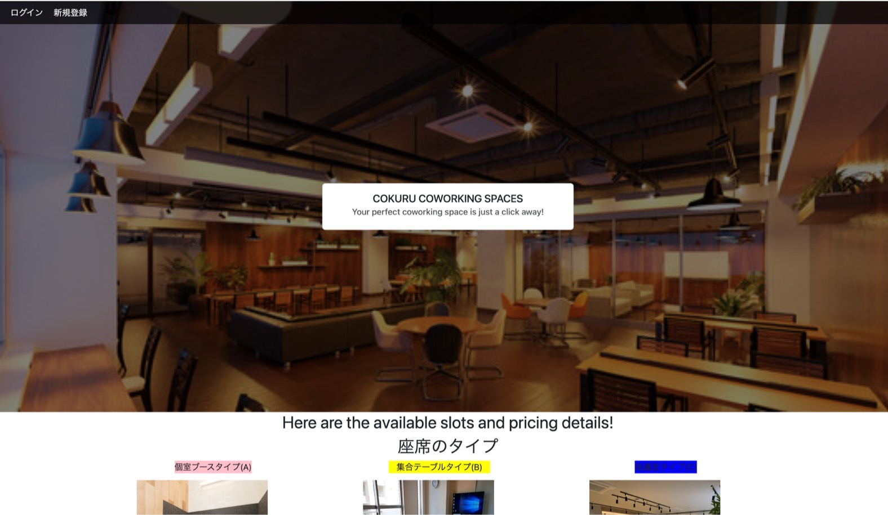
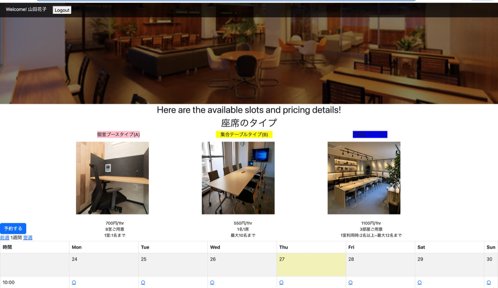
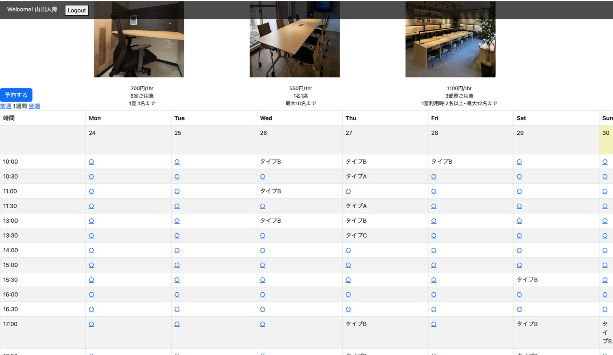
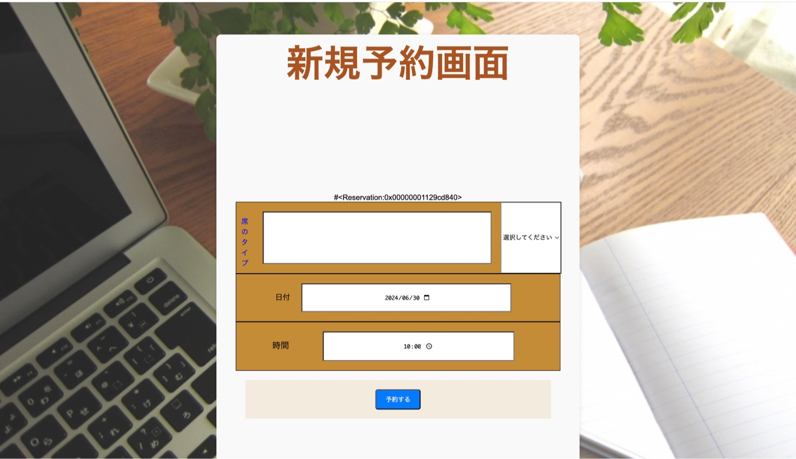
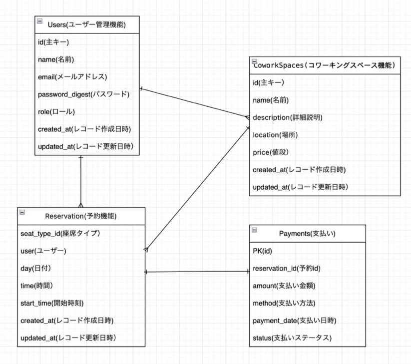

# アプリケーション名
cokuru

# アプリケーション概要
コワーキングスペースを席のタイプごとに日時指定していつでも予約・決済できる。

# URL
https://cokuru.onrender.com/ 

# テスト用アカウント
・Basic認証パスワード：2222 
・Basic認証ID：admin 
・メールアドレス：test2@test.mail	 
・パスワード：a11111 

# 利用方法
1.トップページの左上にある白の「新規登録」ボタンからユーザー新規登録を行う。 
2.新規登録したら、下の方法で予約する。 
①トップページのカレンダーの予約したい日が空席「◯」の場合、「◯」を選択すると新規予約ページに遷移する。 
②新規予約画面のプルダウンから、「席のタイプ」を選択して「予約する」ボタンを押すと購入画面に遷移する。 （クレジット決済機能※は実装中） 
③カレンダーの予約日に予約した「席のタイプ」名が表示されて、予約完了 （※クレジット決済機能：「購入」ボタンを押したら決済画面に遷移し、オンラインクレジット決済できる様に現在、実装中） 

# アプリケーションを作成した背景
近所のコワーキングスペースは電話予約のみ対応しており、どのような席があるのかや空席状況も電話でしか確認できない状態でした。この不便さを解消するため、オンラインでコワーキングスペースの予約ができるアプリを作成しました。 
このアプリにより、家事・育児・仕事・勉強で忙しい人々が、好きな時に簡単にコワーキングスペースの予約や決済を行えるようになり、時間を有効活用できることを目指しています。

# 実装した機能についての画像やGIF及びその説明
トップページ 
 
席のタイプ一覧 
 
カレンダーの表示（空席確認画面） 
 
新規予約画面 
 

# 実装予定の機能
・予約するを押し予約画面に遷移したら予約できるようにする 
・マイページを実装し予約の確認、履歴が見れるようにする 
・クレジット決済機能 

# Usersテーブル　（ユーザー管理機能）
| Column             | Type     | Options                  |
| ------------------ | -------- | ------------------------ |
| id                 | bigint   | null:false,primary key   |
| name               | string   | null:false               |
| email              | string   | null:false, unique: true |
| password           | string   | null:false               |
| created_at         | datetime | null:false               |
| updated_at         | datetime | null:false               |

### Association
has_many :reservations 
has_many :coworking_spaces, through: :reservations

# Reservationsテーブル
| Column             | Type     | Options                          |
| ------------------ | -------- | -------------------------------- |
| seat_type_id       | integr   | null:false,                      |
| user               | refernces| null:false,foreign_key:true      |
| day                | date     | null:false                       |
| time               | datetime | null:false                       |
| start_time         | datetime | null:false                       |
| created_at         | datetime | null:false                       |
| updated_at         | datetime | null:false                       |

### Association
belongs_to :user 
belongs_to :coworking_space 
has_one :payment

# Coworkingspacesテーブル
| Column             | Type     | Options                          |
| ------------------ | -------- | -------------------------------- |
| id                 | int      |null: false, primary key          |
| name               | string   | null:false                       |
| description        | text     | null:false                       |
| location           | string   | null:false                       |
| price              | integer  | null:false                       |
| created_at         | datetime | null:false                       |
| updated_at         | datetime | null:false                       |

### Association
has_many :reservations

# Paymentsテーブル
| Column             | Type     | Options                          |
| ------------------ | -------- | -------------------------------- |
| id                 | int      | null: false, primary key         |
| reservation_id     | bigint   | null: false, foreign_key: true   |
| amount             | integer  | null: false                      |
| method             | string   | null: false                      |
| payment_date       | datetime | null: false                      |
| status             | string   | null: false                      |
| created_at         | datetime | null: false                      |
| updated_at         | datetime | null: false                      |

### Association
belongs_to :reservation

# ER図

# 開発環境
・フロントエンド：HTML/CSS 、Javascripts 
・バックエンド：Ruby, Ruby on Rails 7.0 
・インフラ：Render 
・テキストエディタ：VSCode 

# ローカルでの動作方法
% git clone https://github.com/harunanon/cokuru 
% cd ~/projects/ 
% cd cokuru 

# 制作時間
100時間