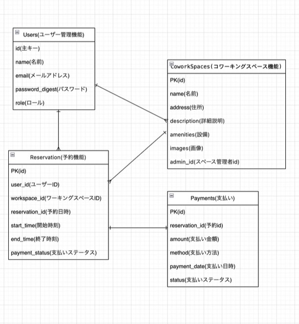

# アプリケーション名
cokuru

# アプリケーション概要
コワーキングスペースを席のタイプごとに日時指定していつでも予約・決済できる。

# URL
https://cokuru.onrender.com/
・Basic認証パスワード：2222
・Basic認証ID：admin

# Usersテーブル　（ユーザー管理機能）
| Column             | Type     | Options                  |
| ------------------ | -------- | ------------------------ |
| id                 | bigint   | null:false,primary key   |
| name               | string   | null:false               |
| email              | string   | null:false, unique: true |
| password           | string   | null:false               |
| created_at         | datetime | null:false               |
| updated_at         | datetime | null:false               |

### Association
has_many :reservations
has_many :coworking_spaces, through: :reservations

# Reservationsテーブル
| Column             | Type     | Options                          |
| ------------------ | -------- | -------------------------------- |
| seat_type_id       | integr   | null:false,                      |
| user               | refernces| null:false,foreign_key:true      |
| day                | date     | null:false                       |
| time               | datetime | null:false                       |
| start_time         | datetime | null:false                       |
| created_at         | datetime | null:false                       |
| updated_at         | datetime | null:false                       |

### Association
belongs_to :user
belongs_to :coworking_space

# ER図

# 開発環境
・フロントエンド：HTML/CSS 、Javascripts 
・バックエンド：Ruby, Ruby on Rails 7.0
・インフラ：Render
・テキストエディタ：VSCode

# ローカルでの動作方法
% git clone https://github.com/harunanon/cokuru
% cd ~/projects/
% cd cokuru

# 制作時間
100時間